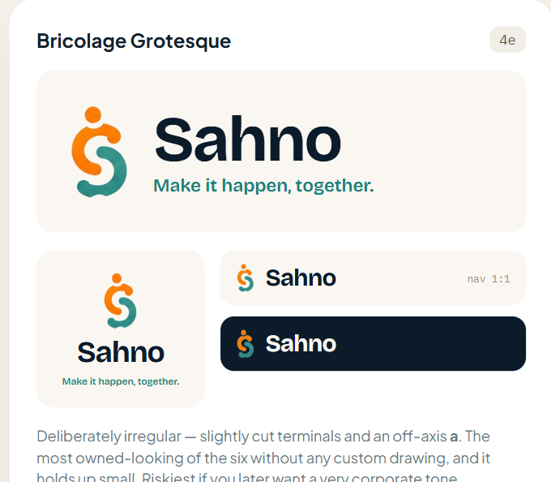

# Sahno Brand Vault

**Status:** Selected v0.1 direction; implementation validation required
**Last updated:** 27 August 2026

This document is the source of truth for Sahno's visual identity direction, approved assets, unresolved refinements, and implementation rules. Do not replace the brand direction or introduce competing fonts, colours, or logo variants without recording the decision here and in `../DECISIONS.md` when material.

## Brand foundation

- **Product name:** Sahno
- **Tagline:** Make it happen, together.
- **Desired character:** modern, energetic, human, coordinated, recognisable, commercially credible, and welcoming without becoming childish or generic SaaS.

## Selected v0.1 direction

The selected candidate combines:

- an abstract human-shaped **S** formed by coordinated orange and teal curves;
- a separate orange dot that contributes to the sense of people and shared movement;
- a deep navy wordmark and primary app-icon background;
- warm off-white backgrounds and surfaces; and
- **Bricolage Grotesque** as the selected wordmark and display-type direction.

The mark should communicate people coordinating and making progress together. It must not be redrawn as a literal person, musical note, chat bubble, heart, hand, or generic progress ring.

## Working colour direction

The approved colour families are:

- **Deep navy:** trust, wordmark, high-contrast text, and the primary app-icon background.
- **Energetic orange:** human energy, initiative, and the upper portion of the mark.
- **Confident teal:** coordination, togetherness, and the lower portion of the mark.
- **Warm off-white:** primary light-theme background and neutral brand canvas.

Exact production HEX, RGB, HSL, and platform colour tokens are not yet locked. They must be taken from the approved vector master rather than sampled from screenshots. Contrast must be verified for text, controls, and status usage before the palette becomes an implementation standard.

## Typography direction

### Selected

- **Wordmark:** Bricolage Grotesque Bold/700 candidate.
- **Display and screen headings:** Bricolage Grotesque SemiBold/600 candidate.
- **Buttons and important labels:** Bricolage Grotesque SemiBold/600 candidate.
- **Tagline:** Bricolage Grotesque Medium/500 candidate.

### To validate

- Test Bricolage Grotesque Regular/400 for body and dense operational UI.
- If it is tiring or unclear at smaller sizes, pair it with a quieter UI family such as Instrument Sans.
- Verify real font rendering, line height, truncation, numerals, and Android/iOS differences inside Expo.
- Confirm commercial-use licensing and package the chosen font files with documented attribution where required.

AI-generated typography previews are directional only. The final decision must be made using the real font files rendered in the application.

## Required logo system

Before the logo is final, create and approve:

- editable vector master;
- primary horizontal lockup;
- stacked lockup;
- standalone mark;
- primary navy-background app icon;
- warm-neutral app-icon variant;
- one-colour dark version;
- reversed white version;
- Android adaptive foreground and background layers;
- Android monochrome icon;
- iOS 1024 × 1024 master;
- favicon and notification-size versions; and
- clear-space and minimum-size rules.

## Validation gates

The v0.1 direction is selected, but it is not yet a final production identity. It must pass:

1. Legibility at 16, 24, 32, and 48 pixels.
2. iOS and Android home-screen testing against varied wallpapers.
3. Android circle, squircle, rounded-square, and other adaptive masks.
4. One-colour and reversed reproduction.
5. Accessible contrast testing for the wordmark, tagline, and product tokens.
6. A visual-similarity review covering health, accessibility, fertility, charity, and social-care branding.
7. A trademark/domain review before significant commercial investment.
8. Real-screen testing on sign-in, navigation, event cards, and organiser dashboards.

## Usage guardrails

- Do not add texture, grain, glow, shadow, or uncontrolled gradients to the mark.
- Preserve clear separation between the orange and teal forms at small sizes.
- Do not stretch, rotate, recolour, outline, or rearrange the approved mark.
- Do not use the tagline where it becomes unreadably small.
- Prefer the navy-background icon as the primary launcher icon candidate.
- Product status colours such as Tentative, Confirmed, Warning, and Success remain semantic UI decisions; do not assume orange and teal can represent every status.

## Open brand decisions

- Final vector geometry of the S mark.
- Exact production colour values and contrast-safe variants.
- Whether Bricolage Grotesque is used for body copy or paired with Instrument Sans.
- Final wordmark tracking and any custom letterform refinements.
- Final app-icon safe-zone proportions.
- Dark-theme palette.
- Final trademark clearance.
